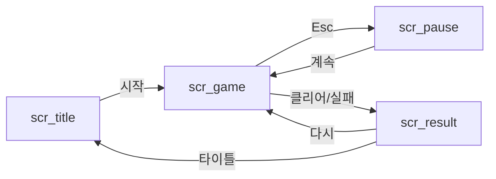

# 게임 UI/UX 명세와 UI 문자열

UI 명세는 엔지니어가 화면을 만들고, QA 가 화면 표시를 실제 값과 대조하고, 현지화 담당이 문구를 번역하는 기준이다. 화면에 보이는 문구는 하나도 빠짐없이 `ui_strings.csv` 에 넣는다. 코드에 한국어를 직접 적으면 번역에서 빠지고, 영어 화면에 한국어가 섞여 나온다.

파일 경로와 형식은 산출물 계약서(`.claude/skills/varco-game-studio/references/contracts.md` 3절, 4-4절)를 따른다.

## 1. 작업 순서

1. 컨셉의 코어 루프를 따라 플레이어가 거치는 화면을 나열한다(타이틀, 설정, 게임, 일시정지, 결과, 대사 창 등). 컨셉 범위 밖 화면(상점, 계정 등)은 만들지 않는다.
2. 화면 흐름을 Mermaid 로 그린다(2절).
3. systems 초안에서 플레이어에게 보여 줄 값을 받아 HUD 를 명세한다(3절).
4. 입력과 접근성을 정한다(4절).
5. 모든 문구를 `ui_strings.csv` 로 모은다(5절).
6. 형식 검사를 돌리고 오류 0건이면 완료를 알린다.

## 2. UX 명세 템플릿 — `_workspace/{slug}/01_ux_spec.md`

````markdown
# {게임 제목} UI/UX 명세

## 화면 목록
| screen_id | 이름 | 목적 | 들어오는 곳 | 나가는 곳 | 우선순위 |
| --- | --- | --- | --- | --- | --- |
| scr_title | 타이틀 | 게임 시작·설정 진입 | 실행 | scr_game, scr_settings | P0 |

## 화면 흐름


## 화면별 명세
### scr_title
| 요소 id | 종류 | 문구(string_id) | 동작 | 배치 |
| --- | --- | --- | --- | --- |
| btn_start | 버튼 | ui.title.start | scr_game 으로 이동 | 가운데 아래 |

## HUD
(3절 표)

## 입력
(4절 표)

## 접근성
## 대사 창
대사를 보여 줄 위치, 화자 이름 표시, 자막 넘김 방식. 대사 문구는 data/strings/{lang}.json 의 line_id 로 읽는다.
````

- `screen_id` 는 `scr_`, 요소 id 는 종류 접두사(`btn_`, `lbl_`, `bar_`, `ico_`)를 붙인 영문 snake_case 로 짓는다. QA 가 브라우저 자동화나 Unity 테스트에서 이 id 로 요소를 찾는다. 웹이면 엔지니어가 이 값을 `data-testid` 로 쓴다.
- 모든 화면에서 나가는 길이 있는지 흐름도로 확인한다. 나갈 수 없는 화면은 진행 불가 버그가 된다.

## 3. HUD 명세

| 요소 id | 보여 줄 값 | 값의 출처 | 형식 | 갱신 시점 | 문구(string_id) |
| --- | --- | --- | --- | --- | --- |
| bar_hp | 현재 체력 / 최대 체력 | 상태 `player.hp` / `player.csv:max_hp` | 바 + 숫자 | 피해·회복 때 | - |
| lbl_lap | 현재 바퀴 / 전체 | 상태 `race.lap` / `levels.csv:laps` | `{current}/{total} 바퀴` | 결승선 통과 | ui.hud.lap |
| bar_boost | 부스트 게이지 | 상태 `player.boost` / `vehicles.csv:boost_max` | 바 | 매 프레임 | - |

- **값의 출처를 적는다.** 게임 상태 이름이나 밸런스 표:열을 적는다. 출처가 없는 값은 QA 가 맞는지 확인할 수 없다.
- **systems 명세의 「플레이어에게 보이는 값」과 하나씩 맞춘다.** 명세에는 있는데 HUD 에 없거나, HUD 에는 있는데 명세에 없는 값이 있으면 systems 에게 묻는다.

## 4. 입력과 접근성

| 행동 | 키보드·마우스 | 터치 | 게임패드 | 비고 |
| --- | --- | --- | --- | --- |
| 드리프트 | Space | 화면 오른쪽 누르기 | A | 누르고 있는 동안 |
| 일시정지 | Esc | 화면 위 ⏸ | Start | |

- 웹 프로토타입은 키보드·마우스를 먼저, 모바일을 겨냥하면 터치도 적는다. 모든 행동에 한 가지 이상의 입력이 있어야 한다.
- 조작 안내 문구의 키 이름은 자리표시자(`{key_drift}`)로 둔다. 키 설정을 바꾸거나 언어가 바뀌어도 문구를 다시 쓰지 않게 하기 위해서다.
- 접근성 최소 기준: 본문 글자 16px 이상(1080p 기준), 색만으로 구분하지 않는다(아이콘·모양 병행), 대사에 자막을 붙인다, 깜빡이는 효과는 초당 3회를 넘지 않는다.

## 5. UI 문자열 표 — `_workspace/{slug}/01_ux_strings.csv`

열: `string_id,context,text_ko,max_len,placeholders`

| 열 | 규칙 | 이유 |
| --- | --- | --- |
| `string_id` | 점으로 구분한 영문 키. `ui.{screen}.{element}` 꼴. 예: `ui.title.start`, `ui.hud.lap` | 코드와 번역 파일이 이 키로 문구를 찾는다 |
| `context` | 어느 화면의 어떤 요소인지, 버튼인지 제목인지 | 같은 "확인"도 버튼과 제목의 번역이 다르다 |
| `text_ko` | 한국어 원문 | |
| `max_len` | 화면에 들어가는 최대 글자 수(정수). 제한이 없으면 빈칸 | 번역 뒤 넘치는지 검사한다 |
| `placeholders` | 문구에 든 자리표시자 이름을 공백으로 구분. 없으면 빈칸 | 번역 단계가 이 이름들을 보호하고, 검사 스크립트가 문구와 대조한다 |

### 번역을 생각한 글자 수

- 버튼·탭·HUD 라벨처럼 공간이 좁은 요소는 한국어 원문을 `max_len` 의 70% 이하로 쓴다. 영어·독일어·러시아어는 한국어보다 길어지는 경우가 있어 여유가 필요하다. 검사 스크립트가 70% 를 넘으면 경고한다.
- 한 문구 안에서 문장을 조립하지 않는다. `"{count}" + "개 남음"` 처럼 나누면 어순이 다른 언어에서 번역할 수 없다. `{count}개 남음` 을 한 문구로 두고 자리표시자를 쓴다.
- 단수·복수가 갈리는 언어를 위해 숫자와 붙는 문구는 되도록 `남은 수: {count}` 처럼 숫자 위치에 영향받지 않는 형태로 쓴다.

### 예시

```csv
string_id,context,text_ko,max_len,placeholders
ui.title.start,타이틀 화면 시작 버튼,시작하기,12,
ui.hud.lap,HUD 오른쪽 위 바퀴 수,{current}/{total} 바퀴,16,current total
ui.tut.drift,튜토리얼 조작 안내,{key_drift} 키를 누르고 있으면 드리프트합니다,40,key_drift
ui.result.title,결과 화면 제목,레이스 완료,,
```

### 형식 검사

```bash
python3 .claude/skills/game-narrative/scripts/check_story_data.py --ui-strings _workspace/{slug}/01_ux_strings.csv
```

`string_id` 형식·중복, `placeholders` 열과 실제 자리표시자 일치, `max_len` 초과를 검사한다. 오류가 0건일 때 완료를 알린다.

## 6. 수정할 때

- 기존 `string_id` 는 바꾸지 않는다. 번역 파일과 코드가 그 키를 쓰고 있을 수 있다. 문구만 바꾸고 바꾼 키 목록을 리더에게 알린다(다시 번역해야 한다).
- 문자열을 지우면 지운 키 목록을 리더에게 알린다.
- 동결 뒤에는 `_v2` 파일로 쓴다.
